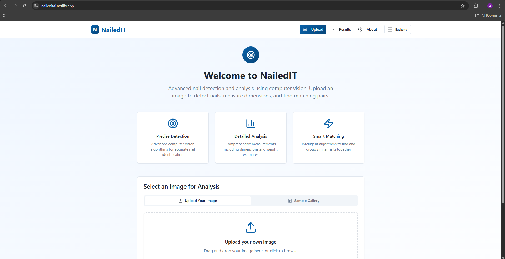

# Nail Detection and Analysis API

This API provides nail detection, measurement, and matching capabilities using computer vision and machine learning.

## Features

- Detect nails in images using YOLOv8
- Estimate nail height and weight
- Match similar nails using either traditional methods or K-means clustering
- Visualize results with annotated images and analysis charts

## Application Screenshots

### Landing Page and Navigation
The NailedIT application features a modern, responsive interface designed for intuitive user interaction.

### Image Upload Interface
Multiple upload methods provide flexibility for users to input nail images for analysis.

### Processing and Analysis
Real-time progress indicators keep users informed during the AI analysis process.

### Results Dashboard
Comprehensive results display with both visual and numerical analysis outputs.

### Analytics and Metrics
Detailed performance metrics and distribution charts for in-depth analysis.

### Matching Results
Visual representation of matched nail pairs with similarity scores and matching criteria.

### Mobile Responsive Design
Optimized mobile experience maintaining full functionality across devices.

  

## Setup and Installation

### Prerequisites
- Python 3.8+
- pip

### Installation

1. Clone this repository:

git clone https://github.com/junnyboy28/NailedIT-backend.git

2. Install dependencies:

pip install -r requirements_backend.txt

3. Download pre-trained model weights (if not included in the repository)

### Running Locally

Start the API server:

python api.py

The API will be available at `http://localhost:8000`, with interactive docs at `http://localhost:8000/docs`.

## API Endpoints

- `POST /api/detect` - Upload and analyze an image
- `GET /api/images/{filename}` - Get processed images
- `GET /api/files/{filename}` - Get result files (CSV)
- `POST /api/evaluate` - Evaluate model on a test dataset

## CLI Usage

You can also use the pipeline directly from the command line:

python run_pipeline.py --image path/to/image.jpg --kmeans --visualize

## Deployment

This API can be deployed to Render using the included configuration.

## Contact

For access to the full training dataset or any questions, contact me: jimilmandani28@gmail.com

